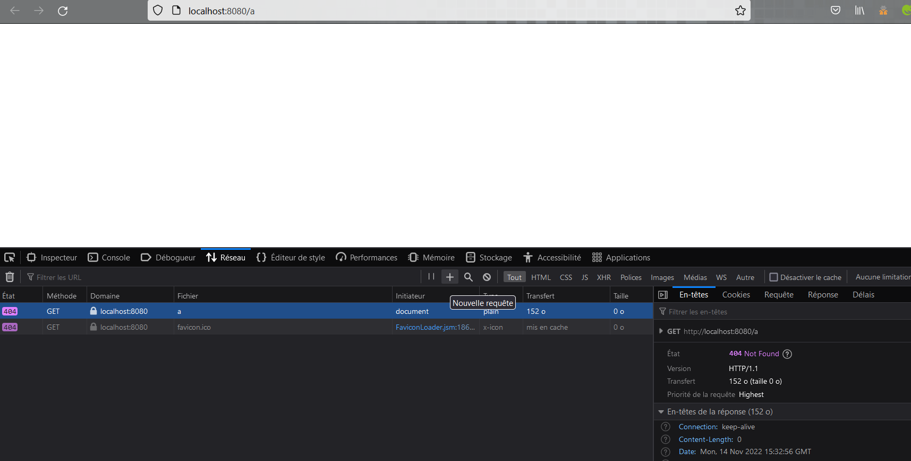
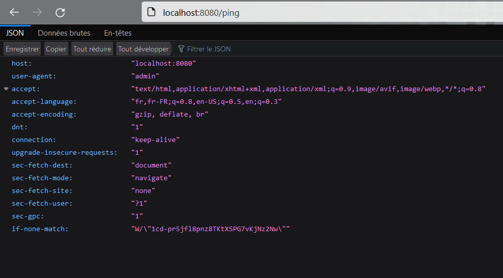

# WIK-DPS-TP01

## 1. Installation

### Commandes pour installer les différents packets nécessaire aux projets

```
npm init -y
 npm install typescript ts-node @types/node @types/express --save-dev
 npm install express --save-dev
```

## 2. Expliquations du code

- Ici, on fait en sorte que toutes les pages non défini retourne une page blanche, accompagné d'une erreur 404

```
app.listen(PING_LISTEN_PORT, () => {
  console.log(
    "The application is listening on port " + PING_LISTEN_PORT + " !"
  );
});
```

- On défini la variable `PING_LISTEN_PORT` pour pouvoir personnaliser le port du serveur web.

```
const PING_LISTEN_PORT = 8080;
```

- On récupère la valeur de la variable qui est donc le port qui va utilisé par le serveur web

```
app.listen(PING_LISTEN_PORT, () => {
  console.log(
    "The application is listening on port " + PING_LISTEN_PORT + " !"
  );
});
```

## 3. Test

### Commandes pour lancer le serveur web

```
npx tsc 	            // build le programme dans le index.js
node .\build\index.js      // lancer le programme dans le index.js
```

- Développer une **API** qui retourne au format **JSON** les **headers** de la **requête** quand il y une requête HTTP GET sur **/ping**
  

> On remarque également que le serveur écoute sur le port **8080**

- Réponse vide avec **code 404** si quoi que ça soit d'autre que **GET /ping**
  
