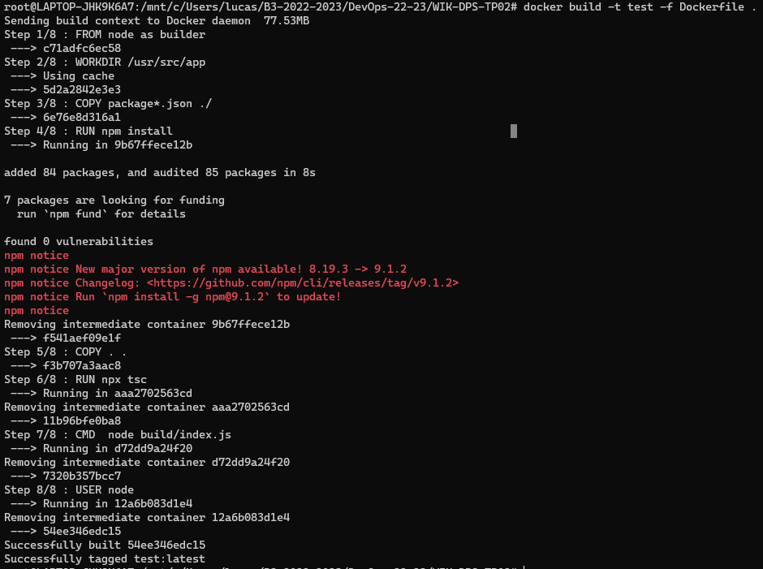
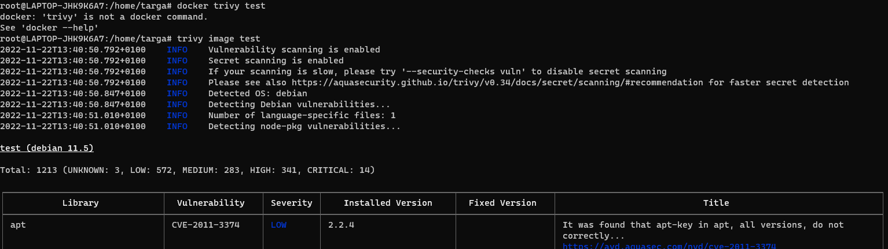
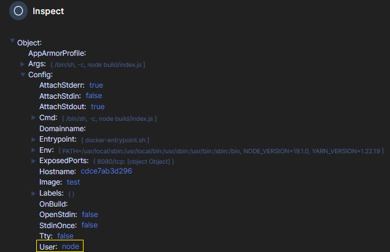
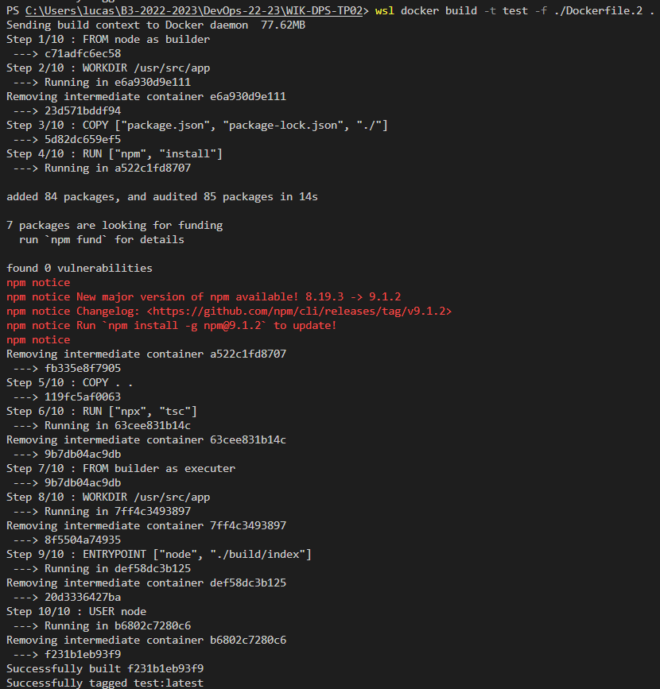
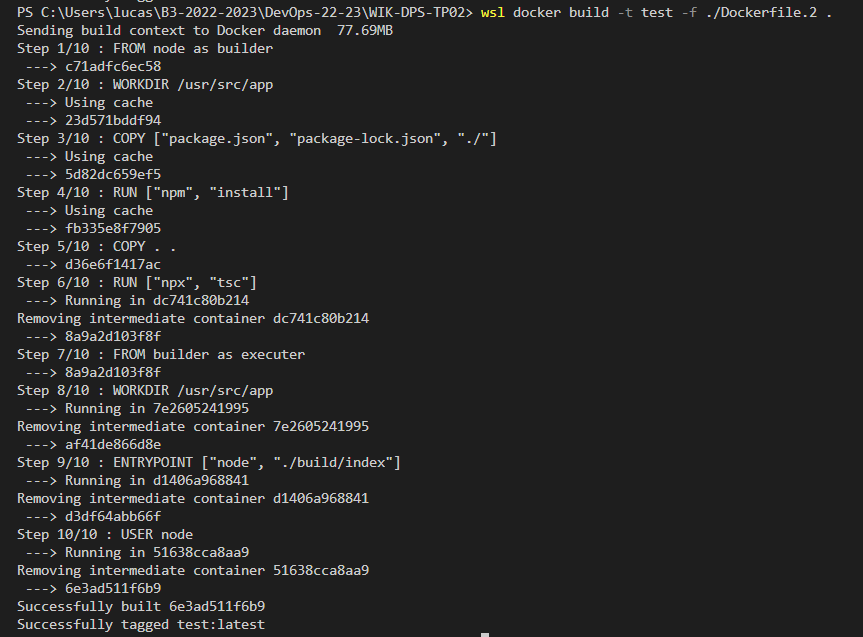
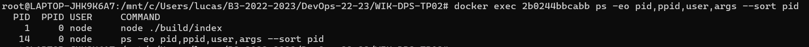

# WIK-DPS-TP02

## Sommaire

- [I. Créer une image Docker avec un seul stage](#i-créer-une-image-docker-avec-un-seul-stage-qui-permet-dexécuter-votre-api-développée-précédemment)
  - [A. L'image doit être la plus optimisée possible](#a-limage-doit-être-la-plus-optimisée-possible-concernant-lordre-des-layers-afin-de-limiter-le-temps-de-build-lors-des-modifications-sur-le-code)
  - [B. Scanner votre image avec trivy](#b-scanner-votre-image-avec-trivy-pour-obtenir-la-liste-des-vulnérabilités-détectées)
  - [C. L'image doit utiliser un **utilisateur spécifique**](#c-limage-doit-utiliser-un-utilisateur-spécifique-pour-lexécution-de-votre-serveur-web)
- [II. Créer une seconde image Docker avec plusieurs stages : un pour l'étape de build et une autre pour l’exécution](#ii-créer-une-seconde-image-docker-pour-votre-api-avec-les-mêmes-contraintes-en-termes-doptimisations-mais-avec-plusieurs-stages)
- [III. Lancement du projet](#iii-pour-lancer-le-projet)

## I. Créer une image Docker avec un seul stage qui permet d’exécuter votre API développée précédemment

[Dockerfile 📄](./Dockerfile)

```
FROM node as builder
WORKDIR /usr/src/app
COPY package*.json ./
RUN npm install
COPY . .
RUN npx tsc
CMD  node build/index.js
USER node
```

## A. L'image doit être la **plus optimisée** possible concernant l'ordre des layers afin de **limiter le temps de build** lors des modifications sur le code

> Le build de l'image docker à partir du dockerfile se fait via la commande `docker build -t test -f ./Dockerfile .` > 

## B. Scanner votre image avec **trivy** pour obtenir la liste des vulnérabilités détectées

> Pour scanner l'image, j'ai utilisé trivy avec la commande : `trivy image test` > 

## C. L'image doit utiliser un **utilisateur spécifique** pour **l'exécution** de votre **serveur web**

Dans le dockerfile, j'ai rajouté `USER node` à la fin du fichier, qui est intégré à l'image de node et permet de lancer le conteneur avec cet utilisateur `node`.
Cela se passe donc pendant le build de l'image.

> depuis un conteneur [Portainer](https://www.portainer.io/), on vérifie si l'utilisateur node est bien présent :



## II. Créer une **seconde image Docker** pour votre API avec les mêmes contraintes en termes d'optimisations mais avec **plusieurs stages**

- L'étape de **build** et une autre pour **l’exécution**

```
## Stage 1 - Build
FROM node as builder
WORKDIR /usr/src/app
COPY ["package.json", "package-lock.json", "./"]
RUN ["npm", "install"]
COPY . .
RUN ["npx", "tsc"]
## Stage 2 - Exécution du serveur
FROM builder as executer
WORKDIR /usr/src/app
ENTRYPOINT ["node", "./build/index"]
USER node
```

- Ci-dessus, le stage de build et d'éxécution sont séparés, j'ai également utilisé la syntaxe d'éxecution pour les commandes `COPY` , `RUN` et `ENTRYPOINT` pour le lancement du serveur.

- Pour le [second Dockerfile 📄](./Dockerfile.2), stage d'éxecution et de build séparés, ce qui rend l'image beaucoup plus rapide à build.

> Premier build  
>  

> Second build , qui est donc **plus rapide** > 

- On peut également voir qu'il n'y plus qu'un process actif sur le conteneur docker qui est l'éxécution du serveur .
  

## III. Pour lancer le projet

1. Cloner le repo avec `git clone https://github.com/EPEYRATAUD/DevOps-22-23`
2. Ouvrir le dossier `WIK-DPS-TP02` dans vscode ou dans un terminal et éxecutez ces commandes :

   - ```
     ## Pour lancer le build avec le dockerfile d'origine
     docker build -t test -f ./Dockerfile .
     ## Pour lancer le build avec le dockerfile multi-stage (plus rapide)
     docker build -t test -f ./Dockerfile2 .
     ```
   - Pour lancer le conteneur docker à partir de l'image que l'on vient de build :

     `docker run -p 8080:8080 test`

- ## [Remonter en haut](#sommaire)
