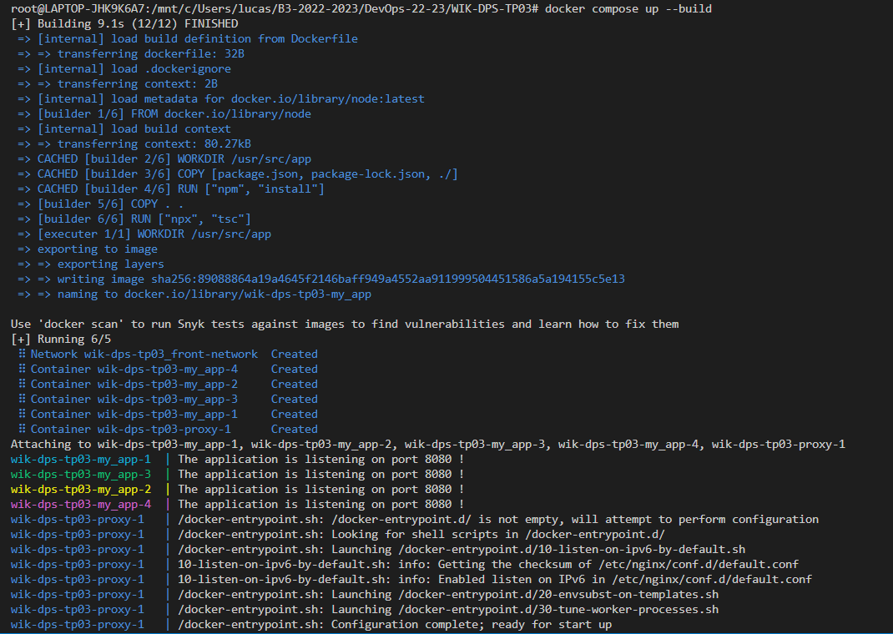
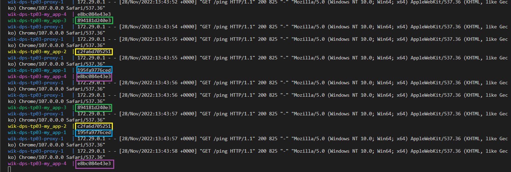

# WIK-DPS-TP03

## Sommaire

- [I. Créer un docker compose avec pour seul service un container basé sur le Dockerfile créé dans le tp précédent](#i-créer-un-docker-compose-avec-pour-seul-service-un-container-basé-sur-le-dockerfile-créé-dans-le-tp-précédent)
  - [ A. Augmenter le nombre de réplicas à 4 pour ce service](#a-augmenter-le-nombre-de-réplicas-à-4-pour-ce-service)
  - [B. Ajouter un reverse-proxy Nginx](#b-ajouter-un-reverse-proxy-nginx)
  - [C. Configurer nginx pour loadbalancer les requêtes vers le service basé sur votre image](#c-configurer-nginx-pour-loadbalancer-les-requêtes-vers-le-service-basé-sur-votre-image)
- [II. Modifier le code de votre API pour afficher le hostname dans les logs à chaque requête sur /ping](#ii-modifier-le-code-de-votre-api-pour-afficher-le-hostname-dans-les-logs-à-chaque-requête-sur-ping)

## I. Créer un docker compose avec pour seul service un container basé sur le Dockerfile créé dans le tp précédent

[Dockerfile-compose 📄](./docker-compose.yaml)

## A. Augmenter le nombre de réplicas à 4 pour ce service

> Ici 4 conteneurs seront crées :

```
 deploy:nginx
      replicas: 4
```

## B. Ajouter un reverse-proxy Nginx

> Le **reverse-proxy** tourne sur le port **8081** et est accessible depuis notre hôte depuis le port **8080**.

```
 # Un service nommé proxy
  proxy:
    # L'image Docker a utilisé pour le service
    image: nginx:latest

    # Monter un fichier du répertoire courant de l'hôte
    # sur le service
    volumes:
      - ./nginx.conf:/etc/nginx/nginx.conf:ro

    # Configurer les ports exposés sur le réseau et
    # le port-forwarding entre l'hôte et le service
    ports:
      - 8080:8081

    # Définir une relation de dépendance
    # Si my_app n'est pas prêt alors pas de proxy
    depends_on:
      - my_app

    # Configure le réseau du service
    # Il est accessible seulement via le réseau nommé
    # front-network
    networks:
      - front-network
```

## C. Configurer nginx pour loadbalancer les requêtes vers le service basé sur votre image

- Depuis [nginx.conf 📄](./nginx.conf)

```
events {}
http {
    server {
        listen 8081;
    location / {
           proxy_pass  http://my_app:8080;
        }
    }
}
```

## II. Modifier le code de votre API pour afficher le hostname dans les logs à chaque requête sur /ping

> Dans les requêtes que l'on récupère, on y ajoute un `console.log` pour récupérer le hostname qui sera visible dans les logs.

- Depuis [index.ts 📄](./src/index.ts)

```
//REQUETE HEADERS//
app.get("/PING", (req, res) => {
  res.send(req.headers);
  console.log(os.hostname());
});
```

- Lancement du [docker-compose 📄](./docker-compose.yaml)



- Observation à chaque refresh de la page :



- ## [Remonter en haut](#sommaire)
