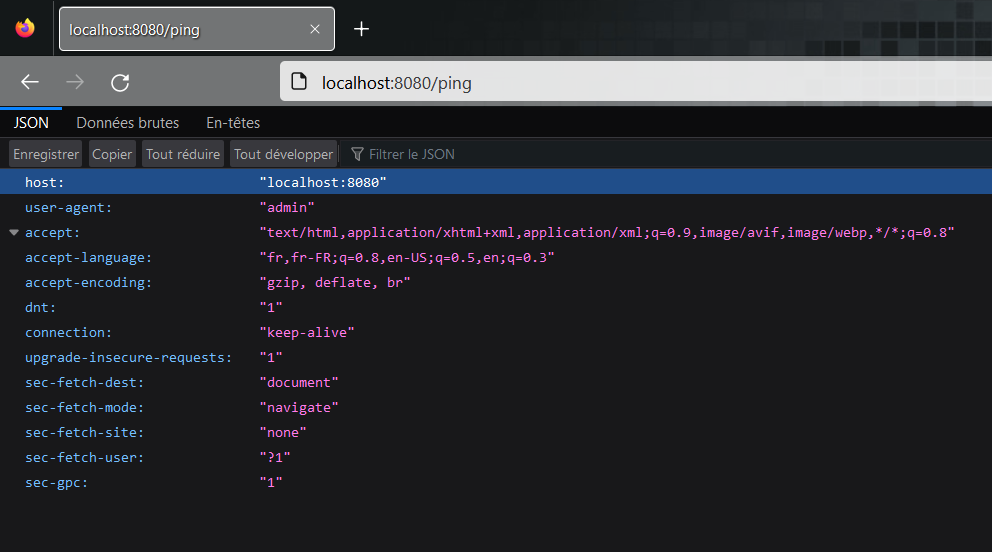
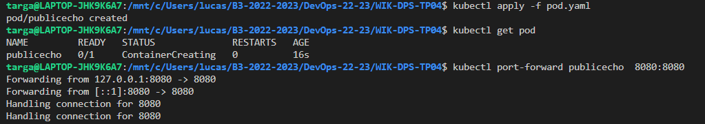
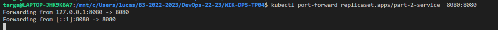
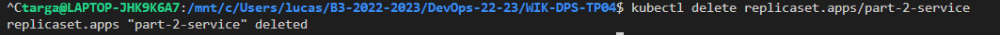
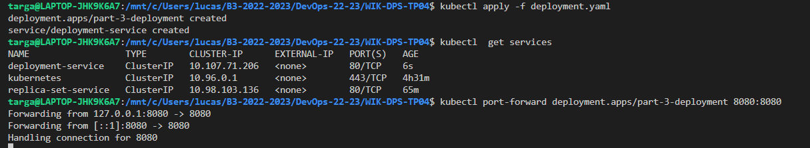
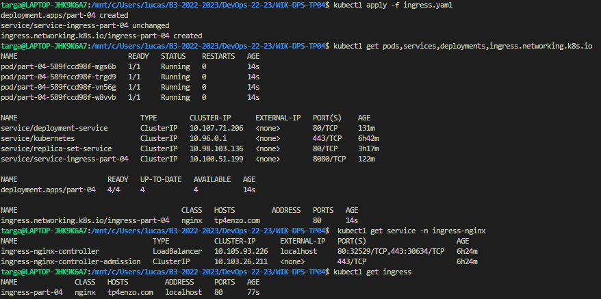
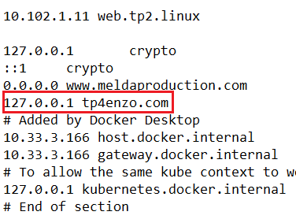
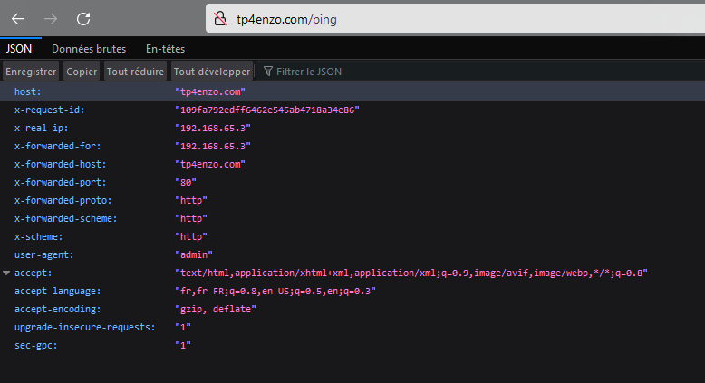

# WIK-DPS-TP04

# Sommaire

- [1. Créer un Pod pour déployer l'image registry.cluster.wik.cloud/public/echo](#1-créer-un-pod-pour-déployer-limage-registryclusterwikcloudpublicecho-cest-limage-créée-lors-du-tp-wik-dps-tp02-et-le-tester-sur-minikube-en-local)
  - [2. Remplacer le Pod par un ReplicaSet afin de déployer 4 réplicas du Pod créé précédemment](#2-remplacer-le-pod-par-un-replicaset-afin-de-déployer-4-réplicas-du-pod-créé-précédemment)
  - [3. Remplacer le ReplicaSet par un Deployment afin de pouvoir définir une stratégie d'update en RollingUpdate](#3-remplacer-le-replicaset-par-un-deployment-afin-de-pouvoir-définir-une-stratégie-dupdate-en-rollingupdate-50-en-maxunavailable)
  - [4. Créer un Service pour pouvoir communiquer avec les Pod du ReplicaSet créé précédemment](#4-créer-un-service-pour-pouvoir-communiquer-avec-les-pod-du-replicaset-créé-précédemment)
- [5. Activer le plugin ingress nginx sur minikube et créer un Ingress (nom de domaine au choix) pour communiquer avec le Service créé précédemment.](#5-activer-le-plugin-ingress-nginx-sur-minikube-et-créer-un-ingress-nom-de-domaine-au-choix-pour-communiquer-avec-le-service-créé-précédemment)
- [6. Tester en ajoutant le nom de domaine choisi dans /etc/hosts afin de résoudre localement vers le service nginx de minikube](#6-tester-en-ajoutant-le-nom-de-domaine-choisi-dans-etchosts-afin-de-résoudre-localement-vers-le-service-nginx-de-minikube)
- [7. Faites une capture d'écran de la page sur votre navigateur avec le nom de domaine de votre choix pour votre service](#7-faites-une-capture-décran-de-la-page-sur-votre-navigateur-avec-le-nom-de-domaine-de-votre-choix-pour-votre-service)

## 1. Créer un Pod pour déployer l'image registry.cluster.wik.cloud/public/echo (c'est l'image créée lors du TP WIK-DPS-TP02) et le tester sur minikube en local

> Voir le [pod.yaml 📄](./pod.yaml)

- **Pour le tester vous devez faire un port-forwarding entre le port du Pod sur lequel votre API écoute et un port sur votre hôte.**




## 2. Remplacer le Pod par un ReplicaSet afin de déployer 4 réplicas du Pod créé précédemment

> Voir le [replicaset.yaml 📄](./replicaset.yaml)




## 3. Remplacer le ReplicaSet par un Deployment afin de pouvoir définir une stratégie d'update en RollingUpdate (50% en maxUnavailable)

> Voir le [deployment.yaml 📄](./deployment.yaml)



## 4. Créer un Service pour pouvoir communiquer avec les Pod du ReplicaSet créé précédemment

> Voir le [ingress.yaml 📄](./ingress.yaml)

```
apiVersion: v1
kind: Service
metadata:
  name: service-ingress-part-04
spec:
  selector:
    app: publicecho
  ports:
    - protocol: TCP
      port: 8080
      targetPort: 8080
```

## 5. Activer le plugin ingress nginx sur minikube et créer un Ingress (nom de domaine au choix) pour communiquer avec le Service créé précédemment.

> Voir le [ingress.yaml 📄](./ingress.yaml)



## 6. Tester en ajoutant le nom de domaine choisi dans /etc/hosts afin de résoudre localement vers le service nginx de minikube



## 7. Faites une capture d'écran de la page sur votre navigateur avec le nom de domaine de votre choix pour votre service



## [Remonter en haut](#sommaire)
